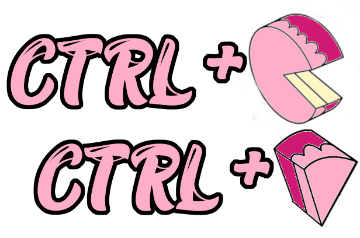

# Modulo 02- Practica de HTML
## Autor: Mora Guzman Jose Antonio
## Copy-Pastel

Para la practica de HTML se nos pidio hacer una pagina de una pasteleria 
**Copy-Pastel** es un juego de palabras entre el termino en ingles de "Copy-Paste" (copiar y pegar) y la palabra pastel, y el slogan "Copiamos tus sentimientos y los pegamos en tu pastel" es como referencia al termino antes mencionado y a que en nuestra pagina puedes fabricar tu pastel como a ti te guste.\
Por otra parte el logotipo es la combinacion de los comandos que usamos en la computadora para copiar y pegar "ctrl+c y ctrl+v" junto con un pastel cortado y una rebanada de pastel que sustituyen a letra c y la letra v respectivamente.\
**Nota: El logo, el slogan y sus significados son ideas propias, las cuales tuve mientras realizaba este proyecto**
## Contenido del proyecto
El proyecto en la [Carpeta principal]() contiene los siguientes archivos:\
* La pagina principal de la pasteleria es el [index.html](https://github.com/JAntonioMoraG/LaunchX-Front-End-Mission/blob/main/02-HTML/index.html):
  * Este archivo es la pagina principal de la pasteleria donde tiene una imagen y un texto de bienvenida y de igual manera un boton para acceder a la pagina donde creas tu pastel (Pagina del usuario)
  
* La [carpeta images](https://github.com/JAntonioMoraG/LaunchX-Front-End-Mission/tree/main/02-HTML/Images) y la [carpeta fonts](https://github.com/JAntonioMoraG/LaunchX-Front-End-Mission/tree/main/02-HTML/fonts) son las imagenes y fuentes usadas en la pagina web

* La [carpeta pages](https://github.com/JAntonioMoraG/LaunchX-Front-End-Mission/tree/main/02-HTML/pages) contiene lo siguiente:
  * La hoja de estilos de la pagina [(style.css)](https://github.com/JAntonioMoraG/LaunchX-Front-End-Mission/blob/main/02-HTML/pages/style.css)  
  * La [carpeta paginaCliente](https://github.com/JAntonioMoraG/LaunchX-Front-End-Mission/tree/main/02-HTML/pages/paginaCliente) la cual contiene el archivo [cliente.html](https://github.com/JAntonioMoraG/LaunchX-Front-End-Mission/blob/main/02-HTML/pages/paginaCliente/cliente.html) la cual es la pagina del cliente que contiene un formulario para crear tu pastel y realizar tu pedido
  * La [carpeta paginaPastelero](https://github.com/JAntonioMoraG/LaunchX-Front-End-Mission/tree/main/02-HTML/pages/paginaPastelero) que contiene el archivo [pastelero.html](https://github.com/JAntonioMoraG/LaunchX-Front-End-Mission/blob/main/02-HTML/pages/paginaPastelero/pastelero.html) es la pagina que contiene unas tablas donde el pastelero puede ver su producto restante asi como sus pedidos 

## Capturas de la pagina
### Index.html

### Cliente.html

### Pastelero.html

